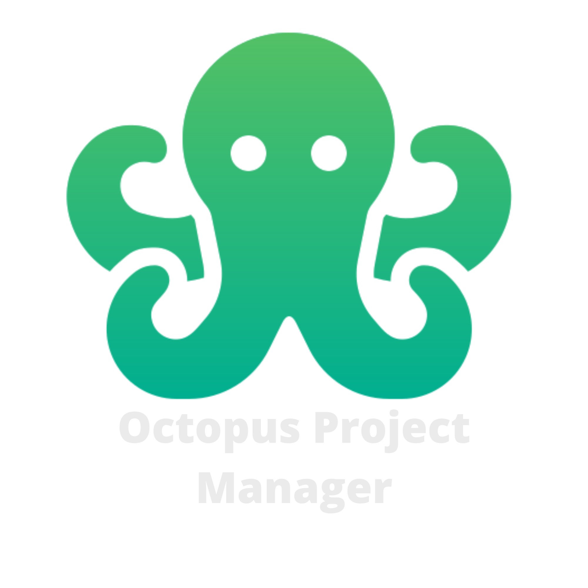

# Octopus Project Manager

<p align="center">
  
</p>

Workspace para la gestión de proyectos, subproyectos y tableros kanban.

## 🛠️ Requisitos Previos

* Node.js (v20+ recomendado)
* pnpm (`npm install -g pnpm`)

## 🚀 Instalación y Configuración Inicial

1. **Instalar dependencias:**
```shell
   pnpm install
```

2. **Aprobar y compilar binarios nativos (SQLite):**
> `better-sqlite3` requiere compilación nativa en Windows. Si es la primera vez que instalas, aprueba el script de construcción y recompila:

```shell
pnpm approve-builds
pnpm rebuild better-sqlite3
```

3. **Iniciar entorno de desarrollo:**
```shell
pnpm dev
```
